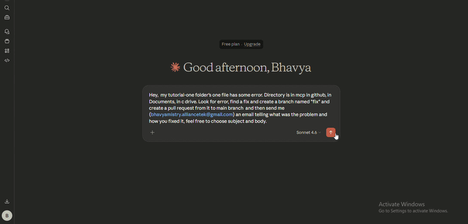

# 📬 MCP Agent

A modular AI agent system that connects a **LangChain-powered LLM** to a **FastMCP tool server** via streamable HTTP. The agent can send emails and interact with GitHub repositories — discovering and calling all tools dynamically at runtime with no hardcoded logic on the client side.


## 📐 Architecture Overview

```
┌─────────────────────────────────────────────────────────────┐
│                        CLIENT SIDE                          │
│                                                             │
│   [User Input]                                              │
│       └─> agent.ainvoke({"messages": [...]})                │
│                    │                                        │
│                    ▼                                        │
│   [LangChain Agent]                                         │
│       └─> model: ChatGroq (openai/gpt-oss-20b)              │
│       └─> tools: fetched dynamically from MCP server        │
│       └─> system_prompt                                     │
│                    │                                        │
│                    ▼                                        │
│   [MultiServerMCPClient]                                    │
│       └─> transport: streamable_http                        │
│       └─> url: http://127.0.0.1:8000/mcp                    │
└────────────────────┬────────────────────────────────────────┘
                     │  HTTP (Streamable MCP Protocol)
                     ▼
┌─────────────────────────────────────────────────────────────┐
│                        SERVER SIDE                          │
│                                                             │
│   [FastMCP Server]  ← mcp.run(transport="streamable-http")  │
│       │                                                     │
│       ├─> send_mail(to, subject, body)    → returns str     │
│       ├─> create_branch(base, new)        → returns str     │
│       ├─> create_pull_request(...)        → returns str     │
│       ├─> commit_file(...)                → returns str     │
│       ├─> list_files(dir)                 → returns str     │
│       ├─> read_files(path)                → returns str     │
│       ├─> file_info(path)                 → returns dict    │
│       └─> search_files(dir, keyword)      → returns dict    │
└─────────────────────────────────────────────────────────────┘
```


## 🔄 Full Execution Flow

```
[User Input]
  └─> Prompt is read from the terminal

             │
             ▼
[Tool Discovery]
  └─> Client connects to the MCP server over streamable HTTP
  └─> All tools are fetched dynamically with their schemas
  └─> No tools are hardcoded on the client side

             │
             ▼
[Agent Construction]
  └─> A ChatGroq model is loaded with the API key
  └─> The agent is assembled with the model, discovered tools, and a system prompt
  └─> System prompt instructs the agent to always use available tools

             │
             ▼
[Agent Invocation]
  └─> The user prompt is passed to the agent as a message
  └─> The LLM selects the appropriate tool based on intent
  └─> Tool arguments are inferred automatically from the prompt

             │
             ▼
[MCP Tool Execution — Server Side]
  └─> FastMCP receives the tool name and arguments over HTTP
  └─> The matching Python function is executed (email, GitHub, filesystem)
  └─> The result is streamed back to the agent

             │
             ▼
[Display to User]
  └─> The final message from the agent is printed to the terminal
```


## 🛠️ Available Tools

All tools are registered on the **FastMCP server** and exposed over `streamable-http`:

| Tool | Signature | Description |
|------|-----------|-------------|
| `send_mail` | `send_mail(to: str, subject: str, body: str) -> str` | Send an email via SMTP |
| `create_branch` | `create_branch(base_branch: str, new_branch: str) -> str` | Create a new GitHub branch |
| `create_pull_request` | `create_pull_request(base_branch, head_branch, title, body) -> str` | Open a GitHub pull request |
| `commit_file` | `commit_file(branch, file_path, content, message) -> str` | Create or update a file in a branch |
| `list_files` | `list_files(directory: str) -> str` | List all files in a directory |
| `read_files` | `read_files(path: str) -> str` | Read the full contents of a file |
| `file_info` | `file_info(path: str) -> dict` | Get metadata: size, type, last modified |
| `search_files` | `search_files(directory: str, keyword: str) -> dict` | Search files recursively for a keyword |


## 📁 Project Structure

```
project_root/
│
├── main.py            # FastMCP tool server (email + GitHub + filesystem tools)
├── client.py          # LangChain agent + MCP client
├── .env               # API keys and credentials (not committed)
├── requirements.txt   # Dependencies
└── README.md
```


## ⚙️ Setup

> You can skip this setup phase (you still need .env file) and jump to the next section if you have **Claude Desktop** installed in your system.

### 1. Install dependencies

```bash
uv add -r requirements.txt
```

### 2. Configure environment variables

Create a `.env` file in the `project_root` directory:

```env
# Email (SMTP)
MAIL_ACCOUNT=your_email@gmail.com
MAIL_PASSWORD=your_app_password
SMTP_SERVER=smtp.gmail.com
SMTP_PORT=587

# GitHub
GITHUB_TOKEN=your_github_token

# LLM
API_KEY=your_groq_api_key
```

> **Tip:** For Gmail, use an [App Password](https://support.google.com/accounts/answer/185833) instead of your main account password.


## 🚀 Running the Project

### Step 1 — Start the MCP server

```bash
uv run main.py
```

The server starts at `http://127.0.0.1:8000/mcp` using the `streamable-http` transport.

```
[FastMCP] Server running on http://127.0.0.1:8000/mcp
```

### Step 2 — Start the agent client

In a separate terminal:

```bash
uv run client.py
```

You'll see an interactive prompt:

```
Type 'exit' to quit.
User:
```

### Step 3 — Chat with the agent

```
Type 'exit' to quit.
User:
send an email to john@example.com with subject "Hello" and body "Meeting at 3pm"

Agent: Email sent successfully to john@example.com.

User:
create a branch called feature/new-tool from main

Agent: Branch 'feature/new-tool' created from 'main' in Bhavya-Mistry/MCP.

User:
list the files in C:\Users\bhavya.mistry\Documents\GitHub\MCP

Agent: .git
       .gitignore
       my-project
       tutorial-one
       ...

User:
exit
```


## 🖥️ Alternative Setup — Use with Claude Desktop

From the `project_root` directory, run:

```bash
uv run mcp install main.py
```

```
[Install Command]
  └─> Registers main.py as an MCP server in Claude's config file
  └─> All tools are made available to Claude Desktop automatically

             │
             ▼
[Restart Claude Desktop]
  └─> Claude reads the updated config on launch
  └─> Tools from main.py are discovered and loaded

             │
             ▼
[Chat with Claude]
  └─> Claude can send emails, manage GitHub repos, and browse files natively
  └─> No terminal or client.py needed
  └─> Same tools, same results
```

> This is the quickest way to use the server if you already have Claude Desktop installed.

## 🎬 Demo


